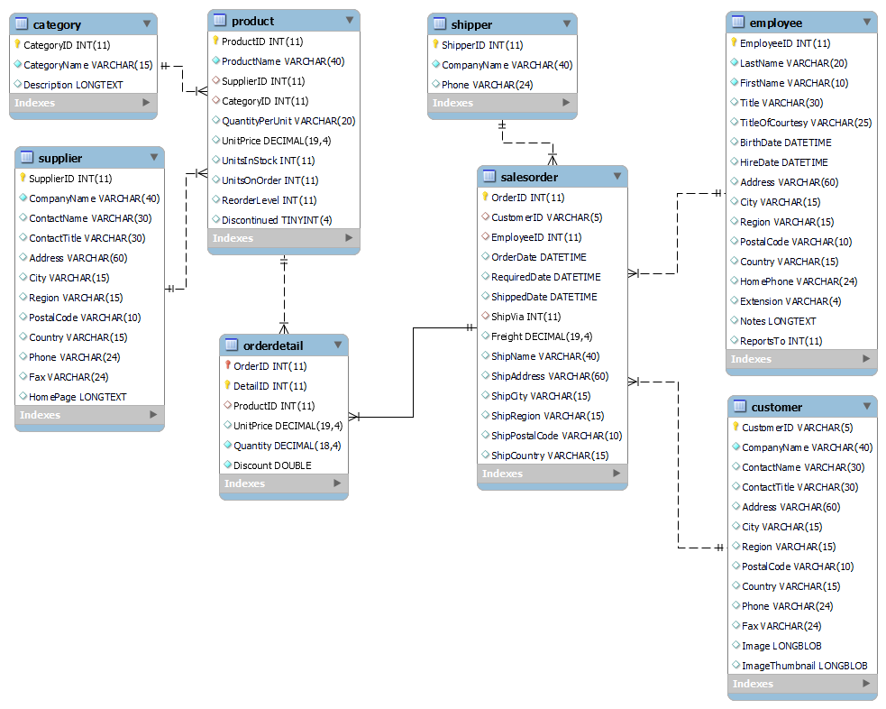

# A light version of Northwind database for MySQL

For easier handling, the script is split into four files:
* nw_schema -  CREATE statements
* nw_data - INSERT statements for all tables expect orderdetails
* nw_orderdetail_data - INSERT statements for orderdetails
* add_regions.sql - replaces null values in Region attributes by appropriate values

## Differences to other versions of Northwind light

* Tables are slightly renamed. 
* The Category and Employee tables come without the pictures.
* Orderdetail has got a new primary key.
* Database engine is InnoDB.
* Foreign keys are declared.
* Dates in SalesOrder and Employee tables are updated to more recent years.
* A sql script is provided that adds values to region attributes in SalesOrder, Customer, and Supplier tables.

The data come from https://documentation.alphasoftware.com/pages/GettingStarted/GettingStartedTutorials/Basic%20Tutorials/Northwind/northwindMySQL.xml
 
 The script adding region values is adapted from https://github.com/jpwhite3/northwind-SQLite3/blob/master/Northwind.Sqlite3.update.sql

